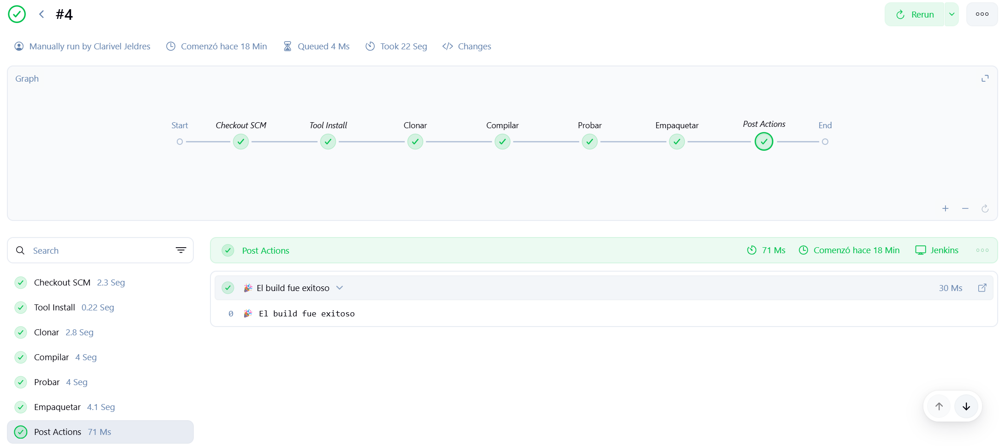

# 👋 saludoapp

Este es un proyecto simple en Java que demuestra cómo configurar un pipeline de integración continua con Jenkins y Maven. El proyecto contiene una función que genera un saludo personalizado y una prueba unitaria con JUnit para verificar su funcionamiento.

## 📦 Características

- Construcción automatizada con Maven
- Pruebas unitarias con JUnit
- Integración continua con Jenkins

## 🛠 Tecnologías utilizadas

- Java JDK 21 
- Maven 3.9.7  
- Jenkins (con Pipeline Declarativo)  
- JUnit 4.13.1  
- GitHub

## 🤖 Jenkins Pipeline
Este proyecto incluye un Jenkinsfile que define las siguientes etapas:

**Clonar:** Clona el repositorio desde GitHub.

**Compilar:** Ejecuta mvn clean compile.

**Probar:** Ejecuta pruebas unitarias con mvn test.

**Empaquetar:** Empaqueta el proyecto con mvn package.

## 💬 Mensajes post-build

* 🎉 Si todo funciona correctamente, se muestra:
"El build fue exitoso"

* 💥 Si alguna etapa falla, se muestra:
"El build falló"

## 📸 Capturas de Jenkins

### ✅ Ejecución exitosa del pipeline en Jenkins

## 🧠 Experiencia
### ¿Qué aprendimos?
* A configurar un proyecto Java con Maven y pruebas unitarias.

* A escribir un Jenkinsfile con múltiples etapas de CI.

* A integrar Jenkins con GitHub para automatizar los builds.

### ¿Qué nos sorprendió más?

* Ver cómo Jenkins automatiza todo el proceso de construcción y prueba del proyecto, ahorrando tiempo.

* Lo sencillo que es generar un build exitoso cuando todo está bien configurado.
